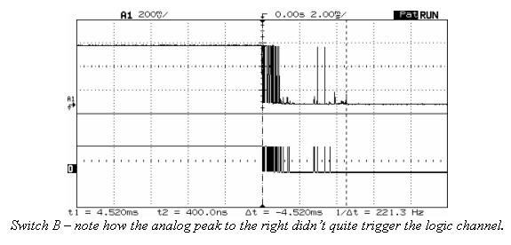

Semana 4
===========
Esta semana realizaremos las siguientes actividades:

Sesión 1: retroalimentación del parcial 1. La acción
de mejora ya se realizó al dejar continuar el parcial
en la casa.

Sesión 2: estudiaremos cómo modelar e implementar sistemas
embebidos usando máquinas de estado.

Sesión 1
^^^^^^^^^
En `este enlace <https://github.com/juanferfranco/sensores1/tree/master/Projects/parcial1>`__
se presenta una posible solución al problema de la evaluación sumativa.

.. seealso:: 

    En `este sitio <http://www.gammon.com.au/millis>`__ se analiza la técnica que
    hemos venido utilizando para medir tiempos sin bloquear el microcontrolador.

Sesión 2
^^^^^^^^^
Para abordar la técnica de programación usando máquinas de estado vamos a
realizar dos ejercicios.

Ejercicio 1
------------
Una experiencia interactiva posee un sensor que produce ruido eléctrico al
cambiar de estado. La siguiente figura, capturada con un osciloscopio
muestra una captura de la señal del sensor.

En la figura se observa el ruido generado en la transición de la señal que
genera el sensor al pasar del estado alto al estado bajo; sin embargo, el
mismo fenómeno ocurre al cambiar del estado bajo al alto. Note que
además pueden ocurrir falsos positivos en la señal, que se manifiestan
como pulsos de muy corta duración.

Un ingeniero electrónica experto nos indica que podemos considerar un
cambio de estado en el sensor siempre que la señal esté estable por
lo menos durante 100 ms, es decir, sin ruido y sin falsos positivos.

Se debe realizar una aplicación que filtre el comportamiento ruidoso
del sensor y reporte por un puerto serial únicamente los valores
estables de la señal.

Ejercicio 2
------------
Se requiere construir una aplicación para controlar una bomba temporizada.
La siguiente figura ilustra la interfaz de la bomba. El circuito de control
de la bomba está compuesto por tres sensores, en este caso pulsadores,
denominados UP, DOWN, ARM (los simularemos con el PC), un display (LCD) y
una salida para activar la bomba (simularemos la salida con el PC).
Los sensores son digitales al igual que la salida de activación de
la bomba. El display posee una interfaz de comunicación serial.
El controlador funciona así:

.. image:: ../_static/bomb.png

* Inicia en modo de configuración, es decir, no cuenta aún, la bomba está
  ``desarmada``. El valor inicial del conteo regresivo es de 20 segundos.
* En el modo de configuración, los pulsadores UP y DOWN permiten
  aumentar o disminuir el tiempo inicial de la bomba.
* El tiempo se puede programar entre 10 y 60 segundos con cambios de 1 segundo.
* El tiempo de configuración se debe visualizar en el LCD (enviamos el
  valor al PC).
* El pulsador ARM arma la bomba.
* Una vez armada la bomba, comienza la cuenta regresiva que será visualizada
  en el LCD en por medio de una cuenta regresiva en segundos.
* La bomba explotará (se activa la salida de activación de la bomba) cuando
  el tiempo llegue a cero. En este punto el control regresará al modo de
  configuración.
* Una vez la bomba esté armada es posible desactivarla ingresando un código
  de seguridad. El código será la siguiente secuencia de pulsadores
  presionados uno después de otro:  UP, DOWN, DOWN, UP, UP, ARM.
* Si la secuencia se ingresa correctamente el controlador pasará de nuevo
  al modo de configuración de lo contrario continuará la fatal cuenta
  regresiva.
