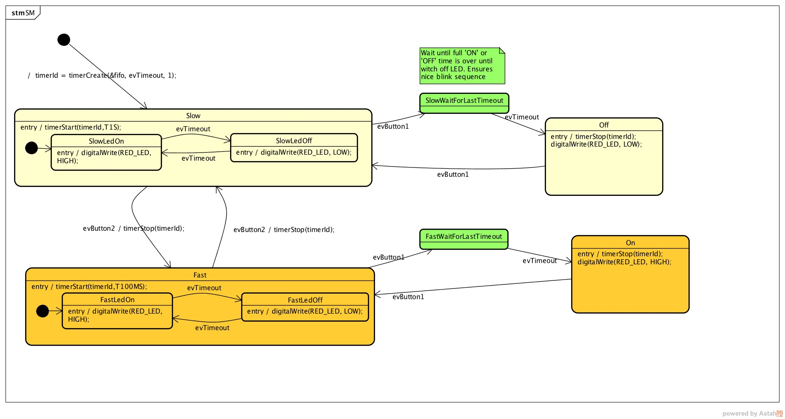

Semana 5
===========

Esta semana terminaremos de abordar la técnica de programación
de sistemas embebidos usando máquinas de estado.

Sesión 1
----------

Actividades
^^^^^^^^^^^^
En esta sesión veremos cómo modelar un problema usado máquinas de estado.

Material
^^^^^^^^^

`Presentación <https://drive.google.com/open?id=1yuDi-tbSpLvV9zAu_TTsXWi9PWn9XyZNPq_NEB4AMao>`__
sobre modelado de sistemas embebidos usando máquinas de estado.

Sesión 2
---------

Actividad
^^^^^^^^^^
En esta sesión se propondrá la construcción del modelo para la bomba y luego
solucionaremos el problema entre todos.

`Aquí <./bomb.ino>`__ queda el trabajo realizado entre todos el día de hoy:

.. code-block:: cpp 
   :lineno-start: 1

    uint32_t Timer = 20;

    enum class BOMBEVS {UP, DOWN, EVTIMER, ARM};
    BOMBEVS bombEvs;
    bool bombEvsFlag = false;

    bool timerInitCount = false;
    uint32_t timeOld = 0;

    void setup() {
    Serial.begin(115200);
    }

    void initCount() {
    timerInitCount = true;
    timeOld = millis();
    }

    void stopCount() {
    timerInitCount = false;
    Timer = 20;
    }

    void taskBomb() {
    enum class BombStates {SETTING, COUNTING};
    static BombStates stateVar =  BombStates::SETTING;
    static uint32_t keyInput[5] = {1, 2, 3, 4, 5};
    static uint8_t counter = 0;
    static uint32_t keyCode = 0;

    switch (stateVar) {
        case BombStates::SETTING:
        if (bombEvs == BOMBEVS::UP) {
            if (Timer < 60) {
            Timer++;
            Serial.println(Timer);
            }
        } else if (bombEvs == BOMBEVS::DOWN) {
            if (Timer > 10) {
            Timer--;
            Serial.println(Timer);
            }

        } else if (bombEvs == BOMBEVS::ARM) {
            initCount();
            stateVar = BombStates::COUNTING;
        }
        break;

        case BombStates::COUNTING:
        if (bombEvs == BOMBEVS::EVTIMER) {

            Timer--;

            if (Timer == 0) {
            Serial.println("RIP");
            for (;;);
            }
            else {

            Serial.println(Timer);
            }
        }
        else if (bombEvs == BOMBEVS::UP) {
            if (counter < 5) {
            keyCode = keyCode + 8 * keyInput[counter];
            counter++;
            }
        } else if (bombEvs == BOMBEVS::DOWN) {
            if (counter < 5) {
            keyCode = keyCode + 17 * keyInput[counter];
            counter++;
            }
        } else if (bombEvs == BOMBEVS::ARM) {
            if(keyCode == 165){
                    keyCode = 0;
                    counter = 0;  
                    Serial.println(":)");
                    stopCount();
                    stateVar = BombStates::SETTING;
            }
            else{
                counter = 0;
                keyCode = 0;
            }
        }

        break;

    }
    }

    void taskInputSerial() {
    if (Serial.available()) {
        int dataRx = Serial.read();
        if (dataRx == 'u') {
        bombEvs  = BOMBEVS::UP;
        bombEvsFlag = true;
        }
        else if (dataRx == 'd') {
        bombEvs  = BOMBEVS::DOWN;
        bombEvsFlag = true;
        }
        else if (dataRx == 'a') {
        bombEvs  = BOMBEVS::ARM;
        bombEvsFlag = true;
        }

    }
    }

    void taskTime() {
    if (timerInitCount == true) {
        uint32_t timeNow = millis();
        if ( (timeNow - timeOld) >= 1000 ) {
        timeOld = timeNow;
        bombEvs = BOMBEVS::EVTIMER;
        bombEvsFlag = true;
        }
    }
    }

    void loop() {

    taskInputSerial();

    taskTime();

    if (bombEvsFlag == true) {
        bombEvsFlag = false;
        taskBomb();
    }

    }
    

Material
^^^^^^^^^
Para la evaluación formativa se propone implementar el modelo que muestra en
esta imagen:

