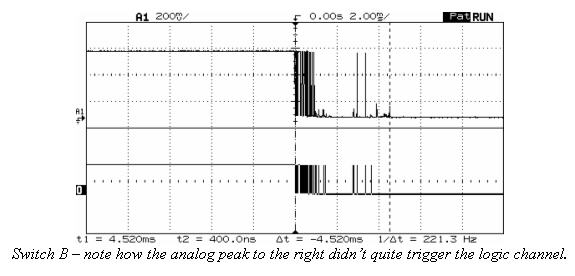

Unidad 3. Software embebidos: modelado e implementación
=========================================================

Introducción
--------------

Cuando escribes software es importante
que te familiarices con patrones arquitectónicos que
te permitan estructurar los programas para favorecer
el trabajo modular y el trabajo en equipo. En esta unidad
te propondré una arquitectura de software que te permitirá
construir aplicaciones para sistemas embebidos guiadas por
eventos mediante el uso de máquinas de estado. Ten presente
que esta técnica no solamente será útil para programar sistemas
embebidos, sino también, aplicaciones interactivas.

Propósitos de aprendizaje
^^^^^^^^^^^^^^^^^^^^^^^^^^

Modelar el software del controlador, mediante el uso de máquinas
de estado, para poder establecer escenarios que permitan
documentar y verificar su funcionamiento.

Implementar el software del controlador mediante las técnicas de
programación adecuadas que permitan sacarle el máximo provecho a
dicho controlador. 

Verificar el software del controlador por medio de la
comparación de resultados de funcionamiento con los posibles
escenarios o vectores de prueba definidos en el modelado.

Temas
^^^^^^

* Modelamiento y programación utilizando máquinas de estado.
* Manejo del puerto serial, medidas de tiempo y retardos
  utilizando técnicas de programación no bloqueantes.

Trayecto de acciones, tiempos y formas de trabajo
---------------------------------------------------

Actividad 1: encuentros sincrónicos
^^^^^^^^^^^^^^^^^^^^^^^^^^^^^^^^^^^^^

* Fechas: 
  
    * febrero 17 de 2021 - 2:00 p.m. Sesión de asesoría y corrección.
    * febrero 24 de 2021 - 2:00 p.m. Sesión de asesoría y corrección.
    * marzo 3 de 2021 - 2:00 p.m. Sesión de retroalimentación y revisión.
    
* Descripción: asesorías en tiempo real y retroalimentación final.
* Recursos: ingresa a `Teams <https://teams.microsoft.com/l/team/19%3a919658982cb4457e85d706bad345b5dc%40thread.tacv2/conversations?groupId=16c098de-d737-4b8a-839d-8faf7400b06e&tenantId=618bab0f-20a4-4de3-a10c-e20cee96bb35>`__
* Duración de la actividad: 6 horas. 
* Forma de trabajo: individual-colaborativo/sincrónico

Actividad 2: preparación para el proyecto
^^^^^^^^^^^^^^^^^^^^^^^^^^^^^^^^^^^^^^^^^^

* Descripción: realiza los siguientes ejercicios de preparación para 
  el proyecto.
* Recursos: ejercicios propuestos
* Duración de la actividad: 7 horas. 
* Forma de trabajo: individual-colaborativo/asincrónico (recuerda programar
  encuentros con tu compañero de trabajo).

Ejercicios
###########

Ejercicio 1
+++++++++++++

Inicia leyendo `este <https://drive.google.com/open?id=1yuDi-tbSpLvV9zAu_TTsXWi9PWn9XyZNPq_NEB4AMao>`__
material.

Ejercicio 2: el puerto serial
+++++++++++++++++++++++++++++++

Observa `este <https://www.youtube.com/embed/nm0EdjXEBGQ>`__ video corto que introducirá como
funcionan las comunicaciones seriales entre un sistema embebidos y una
plataforma de cómputo interactiva.

.. raw:: html

    

        <iframe width="100%" height="315" src="https://www.youtube.com/embed/nm0EdjXEBGQ" frameborder="0" allow="accelerometer; autoplay; encrypted-media; gyroscope; picture-in-picture" allowfullscreen></iframe>
    

Ejercicio 3
+++++++++++++++++++++++++++++++

Ahora lee el material de `este <https://learn.sparkfun.com/tutorials/serial-communication/all>`__
sitio y responde las siguientes preguntas:

* ¿Cuál es la diferencia entre una interfaz de comunicación paralela y una serial?
* ¿Cuál es la diferencia entre un protocolo serial sincrónico y asincrónico?
* En el caso de arduino ¿Qué tipo de protocolo usamos?
* Si el protocolo serial asíncrono que usaremos es de 8 bits, un bit de arranque,
  un bit de parada, sin bit de paridad y a 9600 bps dibuja los diagramas de tiempo cuando
  se transmite el byte 0x01 y el carácter '1'
* ¿Es lo mismo transmitir el byte 0x01 que el byte '1'?

Ejercicio 4
+++++++++++++++++++++++++++++++

¿Dónde encuentro el API de arduino para el manejo del serial?

`Aquí <https://www.arduino.cc/reference/en/language/functions/communication/serial/>`__
Las siguientes preguntas las responderemos en los próximos ejercicios, pero por ahora
lee algunas de las funciones del API del serial y responde:

* ¿Cual es la diferencia entre print y println?
* ¿Cuál es la diferencia entre print y write?
* ¿Qué pasa si utilizas read() cuando available() te devuelva cero?
* ¿Cuál es la diferencia entre readBytes? y readBytesUntil()?
* ¿Qué pasa si quieres leer 10 bytes con readBytes pero solo se han recibido 3?

Ejercicio 5
+++++++++++++++++++++++++++++++

Qué crees que ocurre cuando:

* ¿Qué pasa cuando hago un Serial.available()?
* ¿Qué pasa cuando hago un Serial.read()?
* ¿Qué pasa cuando hago un Serial.read() y no hay nada en el buffer de
  recepción?
* Un patrón común al trabajar con el puerto serial es este:

.. code-block:: cpp
   :lineno-start: 1  

    if(Serial.available() > 0){
        int dataRx = Serial.read() 
    }

* ¿Cuántos datos lee Serial.read()?
* ¿Y si quiero leer más de un dato? No olvides que no se pueden leer más datos
  de los disponibles en el buffer de recepción, claramente porque no hay
  más datos que los que tenga allí.

Ejercicio 6
+++++++++++++++++++++++++++++++

Vamos a leer 3 datos del puerto serial:

.. code-block:: cpp
   :lineno-start: 1  

    if(Serial.available() >= 3){
        int dataRx1 = Serial.read()
        int dataRx2 = Serial.read() 
        int dataRx3 = Serial.read() 
    }

Ejercicio 7
+++++++++++++++++++++++++++++++

¿Qué escenarios podría tener en este caso?

.. code-block:: cpp
   :lineno-start: 1  

    if(Serial.available() >= 2){
        int dataRx1 = Serial.read()
        int dataRx2 = Serial.read() 
        int dataRx3 = Serial.read() 
    }

Ejercicio 8: miniRETO
+++++++++++++++++++++++++++++++

Piense cómo podrías hacer lo siguiente:

.. code-block:: cpp
   :lineno-start: 1  

    void taskSerial(){
        // Esta tarea tiene su propio buffer de recepción,
        // es decir, su propio vector. Nadie más tiene acceso

    }

    void loop(){
        taskSerial();
    }

* Almacenar los datos en su propio buffer de recepción
  (el buffer será un arreglo).
* El buffer debe estar encapsulado en la tarea
* Los datos almacenados en el buffer no se pueden perder
  entre llamados a taskSerial(). La función taskSerial() se llama
  en la función loop.  
* ¿Qué debes hacer para saber, en cualquier parte del código de taskSerial(),
  cuántos datos tengo guardados en el buffer de recepción?

Ejercicio 9
+++++++++++++++++++++++++++++++

Vamos a detenernos un momento en el software del lado del
computador: el terminal. Veamos dos de ellas, la terminal
de arduino y `esta <https://sourceforge.net/projects/scriptcommunicator/>`__
otra (scriptcommunicator)

* ¿Qué es un programa terminal? 
* ¿Para qué sirve?

Ejercicio 10
+++++++++++++++++++++++++++++++

Considera el siguiente programa

.. code-block:: cpp
   :lineno-start: 1  

    void setup()
    {
      Serial.begin(9600);
    }

    void loop()
    {

      if(Serial.available() > 0){

        Serial.read();

        int8_t var = -1;

        Serial.println("Inicio de la prueba");
        Serial.write(var);
        Serial.print("\n");
        Serial.print(var);
        Serial.print('\n');
        Serial.println("Fin de la prueba"); 
      }
    }

* Observa el resultado de la prueba.
* ¿Qué observas en la terminal de arduino justo en estas dos líneas?
 
.. code-block:: cpp
   :lineno-start: 1  

    Serial.write(var);
    Serial.print(var);

* ¿Qué observas en Scriptcommunicator para las dos líneas anteriores?
*  En la siguiente parte del código:

.. code-block:: cpp
   :lineno-start: 1  

    if(Serial.available() > 0){

        Serial.read();

Comenta la línea Serial.read() en esta parte del código:

.. code-block:: cpp
   :lineno-start: 1  

    if(Serial.available() > 0){

        //Serial.read();

* ¿Qué ocurre? ¿Por qué ocurre esto?

En la siguiente parte del código:

.. code-block:: cpp
   :lineno-start: 1  

    Serial.println("Inicio de la prueba");
    Serial.write(var);
    Serial.print("\n");
    Serial.print(var);
    Serial.print('\n');
    Serial.println("Fin de la prueba"); 

¿Cuál es la diferencia entre estas dos líneas de código?

.. code-block:: cpp
   :lineno-start: 1  

   Serial.print("\n");

   Serial.print('\n');

Ejercicio 11: miniRETO
+++++++++++++++++++++++++++++++

Considera el siguiente código para analizar en Scriptcommunicator:

.. code-block:: cpp
   :lineno-start: 1  

    void setup()
    {
      Serial.begin(9600);
    }

    void loop()
    {

      if(Serial.available() > 0){
        Serial.read();
        int8_t var = 255;
        int8_t var2 = 0xFF;

        Serial.write(var);
        Serial.print(var);
        Serial.write(var2);
        Serial.print(var2);

      }
    }

Explica qué está ocurriendo en cada caso.

Ejercicio 12: máquinas de estado
++++++++++++++++++++++++++++++++++++

Una experiencia interactiva posee un sensor que produce ruido eléctrico al
cambiar de estado. La siguiente figura, capturada con un osciloscopio
muestra la señal del sensor.

En la figura se observa el ruido generado en la transición de la señal
al pasar del estado alto al estado bajo; sin embargo, el
mismo fenómeno ocurre al cambiar del estado bajo al alto. Note que
además pueden ocurrir falsos positivos en la señal, que se manifiestan
como pulsos de muy corta duración.

Un ingeniero electrónica experto nos indica que podemos considerar un
cambio de estado en el sensor siempre que la señal esté estable por
lo menos durante 100 ms, es decir, sin ruido y sin falsos positivos.

Se debe realizar una aplicación que filtre el comportamiento ruidoso
del sensor y reporte por un puerto serial únicamente los valores
estables de la señal.

Para este ejercicio debes:

* Realizar un diagrama con el modelo en máquinas de estado para la aplicación
* Definir escenarios de prueba usando diagramas de secuencias.
* Implementar el modelo.
* Verificar los escenarios definidos

Ejercicio 13: miniRETO
+++++++++++++++++++++++++++++++

Se requiere construir una aplicación para controlar una bomba temporizada.
La siguiente figura ilustra la interfaz de la bomba. El circuito de control
de la bomba está compuesto por tres sensores digitales,
en este caso pulsadores, denominados UP, DOWN, ARM (los simularemos con el PC),
un display (LCD) y una salida digital para activar la bomba
(simularemos la salida y el display con el PC).

El controlador funciona así:

.. image:: ../_static/bomb.png

* Inicia en modo de configuración, es decir, no cuenta aún, la bomba está
  ``desarmada``. El valor inicial del conteo regresivo es de 20 segundos.
* En el modo de configuración, los pulsadores UP y DOWN permiten
  aumentar o disminuir el tiempo inicial de la bomba.
* El tiempo se puede programar entre 10 y 60 segundos con cambios de 1 segundo.
* El tiempo de configuración se debe visualizar en el LCD (enviamos el
  valor al PC).
* El pulsador ARM arma la bomba.
* Una vez armada la bomba, comienza la cuenta regresiva que será visualizada
  en el LCD en por medio de una cuenta regresiva en segundos.
* La bomba explotará (se activa la salida de activación de la bomba) cuando
  el tiempo llegue a cero. En este punto el control regresará al modo de
  configuración.
* Una vez la bomba esté armada es posible desactivarla ingresando un código
  de seguridad. El código será la siguiente secuencia de pulsadores
  presionados uno después de otro:  UP, DOWN, DOWN, UP, UP, ARM.
* Si la secuencia se ingresa correctamente el controlador pasará de nuevo
  al modo de configuración de lo contrario continuará la fatal cuenta
  regresiva.

Para este ejercicio debes:

* Realizar un diagrama con el modelo en máquinas de estado para la aplicación
* Definir escenarios de prueba usando diagramas de secuencias.
* Implementar el modelo.
* Verificar los escenarios definidos

.. Solución a ejercicios
  
  `Aquí <https://github.com/juanferfranco/sensores1/tree/master/docs/_semana5/bomb.ino>`__ una solución de 2020-10 al problema:

  .. code-block:: cpp 
    :lineno-start: 1

    uint32_t Timer = 20;

    enum class BOMBEVS {UP, DOWN, EVTIMER, ARM};
    BOMBEVS bombEvs;
    bool bombEvsFlag = false;

    bool timerInitCount = false;
    uint32_t timeOld = 0;

    void setup() {
    Serial.begin(115200);
    }

    void initCount() {
    timerInitCount = true;
    timeOld = millis();
    }

    void stopCount() {
    timerInitCount = false;
    Timer = 20;
    }

    void taskBomb() {
    enum class BombStates {SETTING, COUNTING};
    static BombStates stateVar =  BombStates::SETTING;
    static uint32_t keyInput[5] = {1, 2, 3, 4, 5};
    static uint8_t counter = 0;
    static uint32_t keyCode = 0;

    switch (stateVar) {
        case BombStates::SETTING:
        if (bombEvs == BOMBEVS::UP) {
            if (Timer < 60) {
            Timer++;
            Serial.println(Timer);
            }
        } else if (bombEvs == BOMBEVS::DOWN) {
            if (Timer > 10) {
            Timer--;
            Serial.println(Timer);
            }

        } else if (bombEvs == BOMBEVS::ARM) {
            initCount();
            stateVar = BombStates::COUNTING;
        }
        break;

        case BombStates::COUNTING:
        if (bombEvs == BOMBEVS::EVTIMER) {

            Timer--;

            if (Timer == 0) {
            Serial.println("RIP");
            for (;;);
            }
            else {

            Serial.println(Timer);
            }
        }
        else if (bombEvs == BOMBEVS::UP) {
            if (counter < 5) {
            keyCode = keyCode + 8 * keyInput[counter];
            counter++;
            }
        } else if (bombEvs == BOMBEVS::DOWN) {
            if (counter < 5) {
            keyCode = keyCode + 17 * keyInput[counter];
            counter++;
            }
        } else if (bombEvs == BOMBEVS::ARM) {
            if(keyCode == 165){
                    keyCode = 0;
                    counter = 0;  
                    Serial.println(":)");
                    stopCount();
                    stateVar = BombStates::SETTING;
            }
            else{
                counter = 0;
                keyCode = 0;
            }
        }

        break;

    }
    }

    void taskInputSerial() {
    if (Serial.available()) {
        int dataRx = Serial.read();
        if (dataRx == 'u') {
        bombEvs  = BOMBEVS::UP;
        bombEvsFlag = true;
        }
        else if (dataRx == 'd') {
        bombEvs  = BOMBEVS::DOWN;
        bombEvsFlag = true;
        }
        else if (dataRx == 'a') {
        bombEvs  = BOMBEVS::ARM;
        bombEvsFlag = true;
        }

    }
    }

    void taskTime() {
    if (timerInitCount == true) {
        uint32_t timeNow = millis();
        if ( (timeNow - timeOld) >= 1000 ) {
        timeOld = timeNow;
        bombEvs = BOMBEVS::EVTIMER;
        bombEvsFlag = true;
        }
    }
    }

    void loop() {

    taskInputSerial();

    taskTime();

    if (bombEvsFlag == true) {
        bombEvsFlag = false;
        taskBomb();
    }

    }

  Un ejercicio extra para practicar: se propone implementar el modelo que muestra en
  esta imagen:

  .. image:: ../_static/SM.jpeg

Actividad 3: proyecto y sustentación
^^^^^^^^^^^^^^^^^^^^^^^^^^^^^^^^^^^^^^^

* Descripción: resuelve el proyecto y prepara la sustentación
* Recursos: material de esta unidad
* Duración de la actividad: 14 horas.
* Forma de trabajo: individual

Lee con detenimiento el código de honor y luego los pasos que debes seguir
para evidenciar esta actividad.

Código de honor
#################

Para realizar este proyecto se espera que hagas lo siguiente:

* Colabora con tus compañeros cuando así se indique.
* Trabaja de manera individual cuando la actividad así te lo
  proponga.
* Usa solo la documentación oficial del framework del controlador
  y .NET de Microsoft.
* NO DEBES utilizar sitios en Internet con soluciones o ideas para
  abordar el problema.
* NO DEBES hacer uso de foros.
* ¿Entonces qué hacer si no me funciona algo? Te propongo que
  experimentes, crea hipótesis, experimenta de nuevo, observa y concluye.
* NO OLVIDES, este curso se trata de pensar y experimentar NO de
  BUSCAR soluciones en Internet.

Enunciado
#################

En una experiencia interactiva se requiere comunicar un controlador
con una aplicación interactiva (AI). El controlador maneja varios
sensores y varios actuadores. Debes leer con detenimiento la descripción
del protocolo de comunicación y construir un modelo usando una
máquina de estados que te permita capturar de manera gráfica el texto.
Este modelo te permitirá visualizar más fácilmente
el funcionamiento de tu controlador y todos los posibles escenarios
de prueba que deberás posteriormente verificar.

En este proyecto no vas a implementar la AI, te vas a concentrar en
el software del controlador. Entonces la AI será simulada.

Para simular la AI utiliza `ScriptCommunicator <https://sourceforge.net/projects/scriptcommunicator/>`__.
Este software es necesario para poder controlar de manera precisa el
byte que queremos transmitir. Recuerda que al usar una terminal como
la de arduino, todos los bytes que transmites están codificados en
ASCII y por tanto cuando escribes el carácter '1' realmente estás
transmitiendo el byte 31 en base 16, es decir, la codificación ASCII
del '1'.

Cuando estés probando la aplicación de tu controlador ten presente
que la AI siempre iniciará la comunicación.

Los PASOS para realizar la comunicación son:

* La AI inicia una transacción enviando el byte 3E.
* El controlador deberá responder con el byte 4A.
* La AI no podrá continuar hasta no recibir la respuesta
  del controlador.
* Una vez el controlador responda, la AI enviará una secuencia
  de bytes. 
* Cada byte tendrá la siguiente función:

  Byte 1: longitud

  Byte 2: dirección
  
  Byte 3: comando
  
  Byte 4 a n: datos
  
  Byte n+1: verificación

El byte longitud indicará la cantidad de bytes que la AI le enviará
al controlador a partir del byte 2 hasta el byte n + 1. Para
este ejercicio no te preocupes por los bytes dirección,
comando y datos, puedes colocar allí lo que quieras.

El byte de verificación será calculado así: 

Byte1 XOR Byte2 XOR … XOR Byten.

Recuerda que en lenguaje C el operador XOR es este: ^

* Si la AI se demora más de un 1 segundo en enviar la secuencia,
  el controlador enviará a la AI el byte 3D y la AI deberá iniciar
  de nuevo la secuencia de comunicación desde el paso 1.

* El controlador deberá calcular el byte de verificación que tendrá
  que coincidir con el cálculo de la AI. Si el byte de verificación 
  no corresponde, el controlador enviará el byte 3F y la AI deberá
  reenviar el paquete.

* Si el controlador recibe bien el paquete deberá responder a la AI con
  el byte 4A y luego enviar la siguiente secuencia de bytes:

  Byte 1: longitud

  Byte 2: Byte4 recibido

  Byte m: Byten recibido

  Byte m+1: verificación

La verificación será calculada desde el Byte 1 hasta el byte m.

* Si la AI recibe correctamente el paquete deberá responder con el byte 4A.

* El controlador quedará preparado para volver al paso 1,
  es decir, iniciar una nueva transacción.

* Si pasado 1 segundo el controlador no recibe el 4A, entonces este
  deberá retransmitir el paquete a la AI. Este comportamiento solo 
  se detendrá una vez la AI envié el 4A.

¿Qué debes entregar?
++++++++++++++++++++++

* Crea una carpeta, la llamaremos principal. 
* Guarda allí el proyecto para el controlador.
* Guarda el diagrama, en formato .pdf, con el modelo del
  software del controlador.
* En la carpeta principal guarda una copia de la `rúbrica <https://docs.google.com/spreadsheets/d/1TzlR4PaQZPJrlFNM9YianianLSLw-yC01S8TDYTT0Xg/edit?usp=sharing>`__
  con tu autoevaluación.
* En la carpeta principal guarda un archivo .pdf donde colocarás tres cosas:
  
  * La versión del software para programar el controlador.
  * UN ENLACE a tu ONE DRIVE donde estará alojado el video de sustentación.
  * Una tabla de contenidos que indique el instante de tiempo en el cual se
    pueden encontrar cada una de las secciones solicitadas en el video.

* Comprime la carpeta principal en formato .ZIP
* Entrega el archivo .ZIP `aquí <https://auladigital.upb.edu.co/mod/assign/view.php?id=691976>`__.

¿Qué deberá tener el video de sustentación?
++++++++++++++++++++++++++++++++++++++++++++++

* Máximo 20 minutos: debes planear el video tal como aprendiste en segundo semestre
  en tu curso de narrativa audiovisual.
* Cuida la calidad del audio y del video.
* Sección 1: introducción, donde dirás tu nombre y si realizaste el proyecto
  completo. Si no terminaste indica claramente qué te faltó y por qué.
* Sección 2: muestra y explica detalladamente tu modelo. Nota que en el enunciado
  se definen unos tiempos de espera, así como unos bytes de respuesta. Explica,
  luego de experimentar para qué pueden servir estos mecanismos.
* Sección 3: muestra que tu programa compila correctamente y sin errores
  o advertencias problemáticas. Explica tu programa.
* Sección 4: identifica los posibles escenarios de prueba de tu modelo y
  realiza un `diagrama de secuencias <https://en.wikipedia.org/wiki/Sequence_diagram#:~:text=A%20sequence%20diagram%20shows%20object,the%20functionality%20of%20the%20scenario.>`__
  para cada uno. 
* Sección 5: muestra que tu programa funciona según los escenarios 
  identificados.
* Tus explicaciones deben ser claras, precisas y completas. No olvides planear 
  bien tu video de sustentación.
